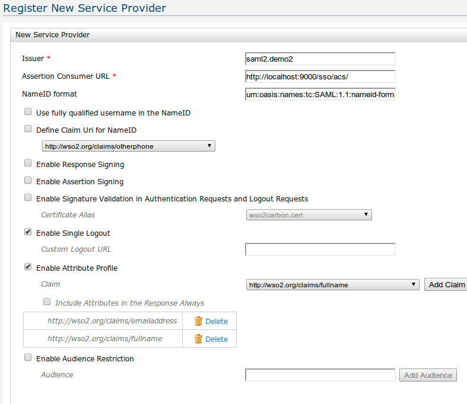
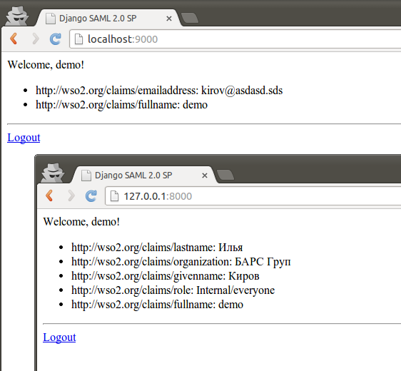
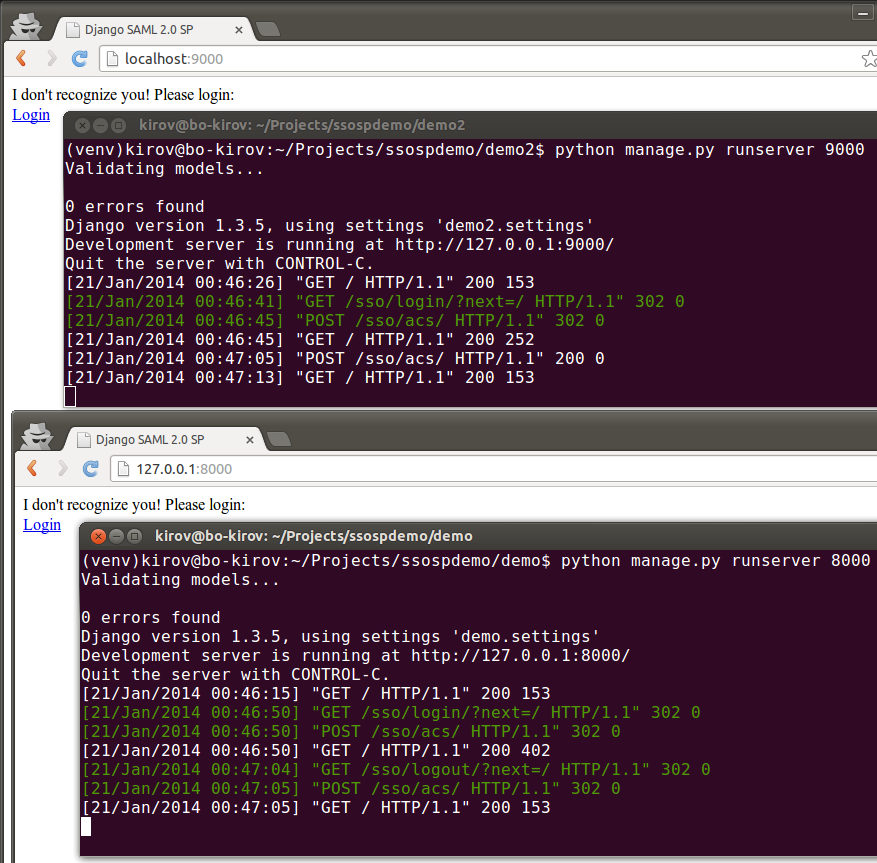

Простое использование
=====================

Примеры простого использования будут основаны на :doc:`демо-приложении
<tutorial>`.

Получение дополнительных сведений о пользователе
------------------------------------------------

Сразу после установки WSO2IS и регистрации нашего приложения
не передается никаких дополнительных атрибутов пользователя.

1.  Заполним атрибуты у созданного ранее пользователя WSO2IS.

    Идем Home > Configure > Users and Roles > Users

    Находим нашего пользователя *demo*, открываем и редактируем его *User
    Profile*.

    ..  figure:: _static/images/WSO2ISUserProfile.png
        :align: center

2.  Затем укажем, какие атрибуты нужно передавать при успешной аутентификации.

    Идем Main > Manage > SAML SSO

    Находим наше приложение *saml2.demo*, открываем и редактируем его.

    Укажем признак *Enable Attribute Profile* и добавим несколько *Claim*.
    Например:

    ..  figure:: _static/images/WSO2ISEditSPAttrs.png
        :align: center

.. Note::

    Обращаю внимание, что после создания профиля атрибутов у
    зарегистрированного поставщика услуг появляется значение *Consumer Index*.
    Которое нужно указывать в настройках нашего приложения.
    Вероятно, можно создать несколько разных профилей атрибутов для одного и
    того же приложения. Но это пока не поддерживается модулем *SSOSP*.

3.  Укажем полученный *Consumer Index* в настройках settings.py:

    ::

        SSO_CONFIG = {
            'idp': 'https://localhost:9443/samlsso', # адрес Identity Provider
            'issuer': 'saml2.demo', # код связи между IdP и SP
            'acs': 'http://127.0.0.1:8000/sso/acs/', # адрес сервиса ACS
            'session_map': 'ssosp.backends.cache', # бэкенд соответствия сессий
            'get_user': 'demo.views.get_or_create_user', # получение пользователя
            'index': '1537824998', # индекс профиля атрибутов (Consumer Index)
        }

4.  Атрибуты, после входа пользователя в систему, сохраняются в сессии
    пользователя.
    Получим их при отображении страницы приложения в функции default (view.py)
    и передадим в шаблон:

    ::

        def default(request):
            attributes = request.session.get('attributes', {})
            tv = {
                'user': request.user,
                'attributes': attributes,
            }
            return render_to_response('default.html', tv)

4.  Добавим отображение атрибутов на странице приложения.

    В шаблоне default.html добавим вывод списка атрибутов.

    ::

        <html>
        <head><title>Django SAML 2.0 SP</title></head>
        <body>
        
        I don't recognize you! Please login: 
        <a href="?next=">Login</a>
        
        Welcome, {{ user.username }}! 
        <ul>
        
        <li>{{ name }}: {{ value }}
        
        </ul>
        

        <a href="?next=">Logout</a>
        
        </body>

5.  Теперь, после входа пользователя, в приложении отображаются атрибуты
    пользователя из *WSO2IS*:

    ..  figure:: _static/images/demo_attrs.png
        :align: center

Подписывание сообщений SAML
---------------------------

Не работает пока :(

    ..  figure:: _static/images/WSO2ISSigning.png
        :align: center

    ..  figure:: _static/images/WSO2ISError.png
        :align: center

    ..  figure:: _static/images/WSO2ISSystemLog.png
        :align: center

Выгрузим сертификат из хранилища сертификатов *WSO2IS*

::

    keytool -importkeystore -srckeystore ./repository/resources/security/wso2carbon.jks -storepass wso2carbon -destkeystore wso2carbon.p12 -deststoretype PKCS12 -srcalias wso2carbon -srcstorepass wso2carbon

Достанем из сертификата закрытый ключ. При выгрузке потребуется ввести
пароль *wso2carbon*.

::

    openssl pkcs12 -in wso2carbon.p12 -nocerts -nodes | openssl rsa > privkey.pem

Достанем также сертификат, чтобы получить из него публичный ключ.
При выгрузке потребуется ввести пароль *wso2carbon*.

::

    openssl pkcs12 -in wso2carbon.p12 -clcerts -nokeys | openssl x509 -pubkey -noout > pubkey.pem

Не работает пока :)

SSO и Single Logout
-------------------

При регистрации нашего приложения или позже, можно настроить возможность
*Единого выхода* для этого приложения. Для этого в описании сервисов *SSO*
*WSO2IS* нужно отметить соответствующий параметр *Enable Single Logout*.

В самом нашем приложении дополнять ничего не нужно. Выход из приложения
обрабатывается модулем *SSOSP* через сервис *ACS*.

Для проверки работы достаточно поднять копию демо-приложения, например,
на порту 9000.
Также, необходимо зарегистрировать в *WSO2IS* эту вторую копию, но
соответственно по другому адресу и с другим параметром *Issuer*.

Во втором приложении необходимо соответственно поменять настройки *issuer*,
*acs* и *index* (если использовался профиль атрибутов) в settings.py.

Если изменилось имя приложения, то надо поправить ссылки *get_user* и
*ROOT_URLCONF* (у нас стало приложение demo2):

::

    ROOT_URLCONF = 'demo2.urls'

    SSO_CONFIG = {
        'idp': 'https://localhost:9443/samlsso', # адрес Identity Provider
        'issuer': 'saml2.demo2', # код связи между IdP и SP
        'acs': 'http://localhost:9000/sso/acs/', # адрес сервиса ACS
        'index': '1906473741',
        'session_map': 'ssosp.backends.cache', # бэкенд соответствия сессий
        'get_user': 'demo2.views.get_or_create_user', # получение пользователя
    }

После запуска двух приложений, при входе в первое из приложений будет запрошен
логин и пароль пользователя *WSO2IS*. При входе во второе приложение уже не
потребуется вводить логин и пароль (при условии, что это происходит в одном
браузере). **Вот оно SSO!**

Теперь, при выходе из одного из приложений, на второе приложение придет запрос
о завершении сессии на адрес *ACS*. В результате, при обновлении страницы
второго приложения пользователь окажется не авторизован. Т.е. пользователь
выйдет из обоих приложений.

    В истории запросов второго приложения нет обращения к /logout

Бэкенд соответствия сессий
--------------------------

