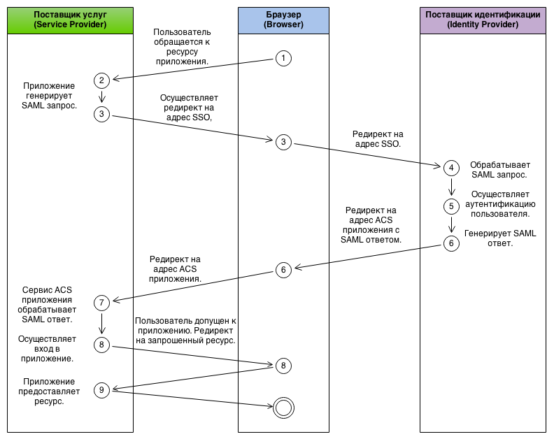
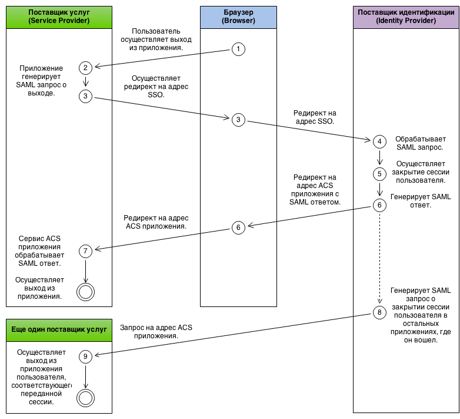

Описание
=========

Назначение
----------

Модуль SSOSP предназначен для более простой интеграции *SSO* в веб-приложения
на Django по спецификации *SAML*. Реализуется функционал поставщика услуг
(*SP*) по взаимодействию с поставщиком идентификации (*IdP*) для обеспечения
технологии единого входа и выхода (*SSO*).
Поддерживается *SAML* с цифровой подписью сообщений.

В качестве протокола взаимодействия используется спецификация SAML версии 2.0.

.. Note:: Терминология

   *SSO* - `Технология единого входа`_ в комплекс приложений (`Single Sign-On`_
   ).

   *SAML* - Язык разметки подтверждения безопасности (`Security Assertion
   Markup Language`_) используется для обеспечения сквозной аутентификации при
   работе через браузер.

   *SP* - Поставщик услуг (Service provider в терминах *SAML*), защищенный
   сервис предоставляющий ресурсы. Обычно, это веб-приложение или веб-сервисы.

   *IdP* - Поставщик идентификации (Identity provider в терминах *SAML*),
   выполняющий аутентицикацию пользователя, запрощенную поставщиком услуг.

   *ACS* - Сервис обработки утверждений (Assertion Consumer Service в
   терминах *SAML*) на стороне поставщика услуг, получающий запросы со
   стороны поставщика идентификации.

   *Single Logout* - подразумевает *Единый выход* из приложений, в которые
   вошел пользователь через *IdP*. Т.е. при выходе из одного приложения,
   автоматически происходит выход из остальных.

Согласно спецификации SAML, *SP* обращается к *IdP* для аутентификации
пользователя, обратившегося к *SP* с каким-либо запросом.

Примерные схема взаимодействия между участниками по спецификации SAML на
примере единого входа:

   Шаги единого входа в приложение

Модуль реализует функционал *SP* и *ACS*. Согласно схеме выше, реализуются шаги
№2, №3, №7. Шаги №8 и №9 реализуются непосредственно приложением, в которое
встраивается данный модуль.

Дополнительно, реализуется механизм *Single Logout*, который при выходе
пользователя позволяет осуществить корректный выход из всех приложений, в
которые он заходил.

   Шаги единого выход из приложения

В этом взаимодействии модуль реализует шаги №2, №3, №7 и №9.

Структура
---------

Модуль содержит реализацию обработчиков:

* Входа в приложение
* Выхода из приложения
* Сервиса обработки утверждений (*ACS*)

Работа с *SAML* реализована через классы SAML-запросов: AuthRequest,
LogoutRequest. И SAML-ответов: AuthResponse, LogoutResponse.

Поддержка механизма *Single Logout* требует хранения соответствия
Django-сессии и сессии на *IdP*, чтобы при завершении сессии *IdP* закрывать
соответствующую Django-сессию.
Хранение соответствия сессий реализовано через механизм включения необходимого
бэкенда. В модуль входят 2 вида бэкенда:

* Хранение соответствия в БД (модель SSOSession).
* Хранение соответствия в кэше Django.

.. _Технология единого входа: http://ru.wikipedia.org/wiki/%D0%A2%D0%B5%D1%85%D0%BD%D0%BE%D0%BB%D0%BE%D0%B3%D0%B8%D1%8F_%D0%B5%D0%B4%D0%B8%D0%BD%D0%BE%D0%B3%D0%BE_%D0%B2%D1%85%D0%BE%D0%B4%D0%B0
.. _Single Sign-On: http://en.wikipedia.org/wiki/Single_sign-on
.. _Security Assertion Markup Language: http://en.wikipedia.org/wiki/Security_Assertion_Markup_Language
