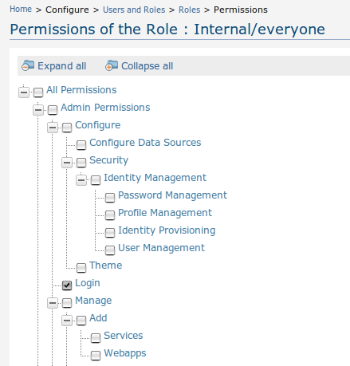
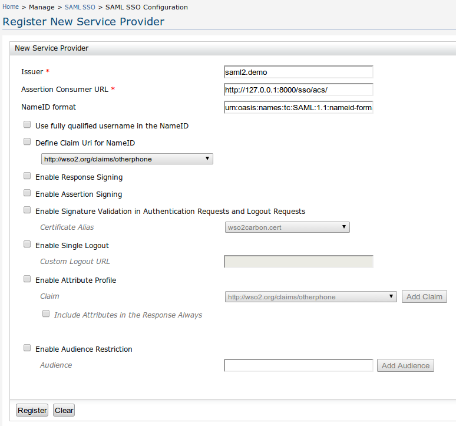
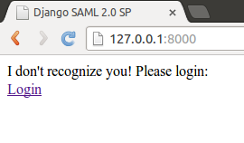
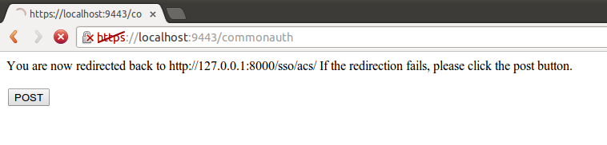
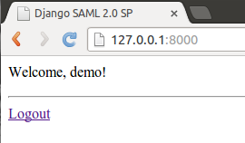
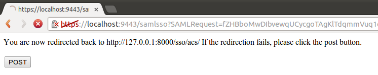

Демо проект
===========

Быстренько напишем демонстрационный проект и проверим его работу.

Для проверки приложения возьмем, например, бесплатный *IdP*
`WSO2 Identity Server`_.

..  _`WSO2 Identity Server`: http://wso2.com/products/identity-server/

Разворачиваем WSO2 Identity Server
----------------------------------

1.  Скачиваем дистрибутив
    https://svn.wso2.org/repos/wso2/people/dulanja/scratch/wso2is-4.6.0.zip

2.  Распаковываем wso2is-4.6.0.zip в папку wso2is-4.6.0

3.  Запускаем *WSO2IS*

    ::

        /wso2is-4.6.0/bin/wso2server.sh (или *bat* для Windows)

4.  Заходим в *WSO2IS* https://localhost:9443/carbon/
    (пользователь *admin* пароль *admin*)

5.  Создадим нового пользователя.

    Идем Home > Configure > Users and Roles > Users > Add New User

    Создадим пользователя *demo* с паролем *demo123*.

6.  Добавим право входа для пользователя.

    Идем Home > Configure > Users and Roles > Roles

    Редактируем права (Permission) для роли *Internal/everyone*.

    Выставим право *Login*

7.  Зарегистрируем новый Service Provider (который напишем чуть позже).

    Идем Main > Manage > SAML SSO > Register New Service Provider

    Создадим поставщика услуг:

    ::

        Issuer: saml2.demo

        Assertion Consumer URL: http://127.0.0.1:8000/sso/acs/

Пишем приложение
----------------

1.  Подготавливаем виртуальное окружения для приложения:

::

    mkdir ssospdemo

    cd ssospdemo

    virtualenv --no-site-packages ./venv

    source ./venv/bin/activate

    pip install lxml rsa xmldsig django ssosp -i http://pypi.bars-open.ru/simple

2.  Создаем проект:

::

    django-admin.py startproject demo

3.  В settings.py добавляем блок настройки SSO:

::

    SSO_CONFIG = {
        'idp': 'https://localhost:9443/samlsso', # адрес Identity Provider
        'issuer': 'saml2.demo', # код связи между IdP и SP
        'index': '1537824998', # индекс связи между IdP и SP
        'acs': 'http://127.0.0.1:8000/sso/acs/', # адрес сервиса ACS
        'session_map': 'ssosp.backends.cache', # бэкенд соответствия сессий
        'get_user': 'demo.views.get_or_create_user', # получение пользователя
    }

    Также в INSTALLED_APPS добавляем наш модуль 'ssosp':

::

    INSTALLED_APPS = (
        'django.contrib.auth',
        'django.contrib.contenttypes',
        'django.contrib.sessions',
        'django.contrib.sites',
        'django.contrib.messages',
        'django.contrib.staticfiles',
        'ssosp',
    )

    Указываем какую-нибудь базу данных для проекта:

::

    DATABASES = {
        'default': {
            'ENGINE': 'django.db.backends.sqlite3',
            'NAME': 'demo',
        }
    }

    И укажем где искать шаблоны приложения:

::

    import os
    PROJECT_ROOT = os.getcwd()

    TEMPLATE_DIRS = (
        '%s/templates' % PROJECT_ROOT,
    )

4.  Создаем файл view.py, в котором будет функция отображения главной страницы
    (default) и метод поиска пользователя по переданным атрибутам
    (get_or_create_user).

    Функция *get_or_create_user* ищет пользователя по переданному от *IdP*
    userid и если не находит, то создает нового пользователя.

::

    #coding:utf-8
    from django.shortcuts import render_to_response
    from django.contrib.auth.models import User
    from django.conf import settings

    def default(request):
        attributes = request.session.get('attributes', {})
        tv = {
            'user': request.user,
            'session': request.session,
            'idp_logout_url': None,
            'idp_login_url': None,
            'attributes': attributes,
        }
        return render_to_response('default.html', tv)

    def get_or_create_user(userid, attributes):
        try:
            user = User.objects.get(username=userid)
        except User.DoesNotExist:
            user = User.objects.create_user(userid, userid)
        # возьмем первый попавшийся бэкенд
        user.backend = settings.AUTHENTICATION_BACKENDS[0]
        return user

5.  В url.py добавляем ссылки на SSO и главную страницу:

::

    from views import default

    urlpatterns = patterns('',
        url(r'^sso/', include('ssosp.urls')),
        url(r'^', default, name="default"),
    )

6.  В папке 'templates' создаем файл шаблона главной страницы default.html:

::

    <html>
    <head><title>Django SSO SP</title></head>
    <body>
    
    I don't recognize you! Please login: 
    <a href="?next=">Login</a>
    
    Welcome, {{ user.username }}! 
    <ul>
    
    <li>{{ name }}: {{ value }}
    
    </ul>
    

    <a href="?next=">Logout</a>
    
    </body>

.. Note::

    Для Django 1.5 и старше, в тэге *url* следует указывать имя функции в
    кавычках:
    

7.  Создаем базу и запускаем пример:

::

    cd demo

    python manage.py syncdb

    python manage.py runserver

Проверяем
---------

Открываем страницу приложения http://127.0.0.1:8000

и нажимаем на *Login* для входа в наше приложение.

Произойдет редирект на адрес *IdP*, который мы указали в настройках
https://localhost:9443/samlsso

Так как мы еще не авторизованы, то *WSO2IS* запросит у нас имя пользователя
и пароль.

.. figure:: _static/images/WSO2ISAuth.png
   :align: center

После успешной аутентификации, *WSO2IS* редиректит нас обратно в наше
приложение на адрес *ACS*, где приложение обрабатывает результаты
аутентификации и пропускает нас в приложение.

Это происходит достаточно быстро, поэтому можно не заметить как промелькнет
эта страница:

Всё! Теперь наше приложение успешно пустило нас.

После работы попробуем выйти из приложения нажав *Logout*

После серии редиректов мы возвращаемся к первоначальному состоянию.